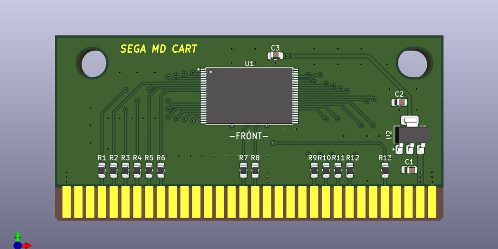

#### SEGA MD Cart - картридж для SEGA MegaDrive/Genesis

Простой картридж объемом до 4MB (32Mbit) без сохранений, который можно перезаписывать с помощью программатора [FlashKit MD](https://github.com/JRBVZz/Flashkit-MD).

Для хранения данных используется flash память в корпусе TSOP-48 - S29GL032, MX29LV320, M29W320 и др. Для игр до 2MB можно использовать память меньшего объема.

**Параметры для изготовления PCB**  
* 2 слоя
* Толщина PCB: 1.6 мм
* Рекомендуется ENIG покрытие контактов краевого разъема

**Схема**  
[Schematic PDF](SEGA-Cart-Info/SEGA-Cart-Schematic.pdf)

**Интерактивный BOM**  
[BoM](SEGA-Cart-Info/SEGA-Cart-iBOM.html) (для корректного просмотра нужно скачать raw файл)

Проект создан в [**KiCad 9**](https://www.kicad.org/).